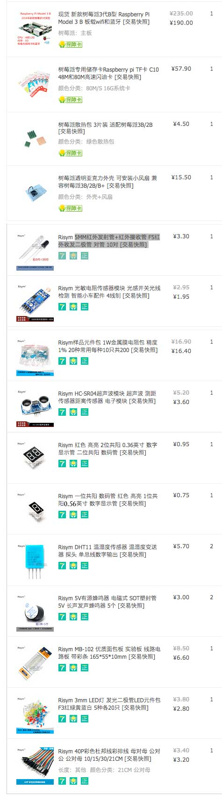

# 准备工作
开始动手前，需要准备一块树莓派主板和相关的电子元件，这些东西都可以在某宝买到。

## 网购
### 树莓派最小配置
* 树莓派 Raspberry Pi 3主板
* Micaro SD 卡带 Raspbian 操作系统
* Android 手机数据线
* HDMI 连接线（各种电视盒子带的 HDMI 线均可）
* 带 HDMI 接口的显示器或电视机
* 鼠标键盘

### 树莓派可选配置
* 充电宝
* 树莓派主板散热片
* 树莓派亚克力外壳

### 电子元件
* 面包板
* 杜邦线（公对母）
* LED 灯
* 蜂鸣器（5V 有源）
* DHT11温湿度传感器
* 0.56英寸一位共阳数码管
* 0.36英寸双位共阳数码管
* 电阻包
* 4线光敏电阻传感器 mk134
* HC-SR04 超声波模块
* 5MM红外发射管+红外接收管

### 订单截图


共计花费 ¥314.20 元

## 组装
* ［插 SD 卡］将sd卡插入树莓派3主板的sd插槽中，注意sd卡有字的一面朝外，将sd卡插入后推到底会自动卡住，如果要取出sd卡，只要再往里一推就会弹出来。
* ［连接显示器］将显示器和树莓派3主板用 HDMI 线连接起来，如果你连的是电视机，请将电视机的信号源切换为 HDMI。
* ［连接鼠标键盘］将鼠标、键盘插在 USB 接口上。
* ［供电］准备给树莓派供电，树莓派电源接口和 Android 手机的电源接口一样，插上充电器或者充电宝。树莓派没有开机按钮，一通电就开机了。
* ［登录系统］如果显示器连接正常的话，这时候应该看到开机画面了，如果出现登录界面，用户名输入 `pi`，密码输入 `raspberry`。
* ［加入网络］进入系统后，点击屏幕右上角的 Wi-Fi 图标，加入无线网。至此，配置完成，树莓派已经是你家局域网中的一台微型计算机了。如果你习惯远程登录，你直接使用ip就可以ssh登录到树莓派上了。
  ```
  ssh pi@xxx.xxx.xxx.xxx
  ```

## 相关课程目录
1. [准备工作](../01prepare)
1. [点亮LED](../02blink)
1. [呼吸灯](../03fading-led)
1. [用单位数码管显示数字倒计时](../04digital-1)
1. [用双位数码管显示CPU温度](../05digital-2)
1. 控制蜂鸣器发声
1. 用温湿度探头检测室内温度
1. 用光敏传感器检测光线强度
1. 超声波测距
1. 红外遥控器
1. 声控灯
1. 进步电机
1. 用液晶显示器显示文字
1. 继电器
1. 让摄像头工作
